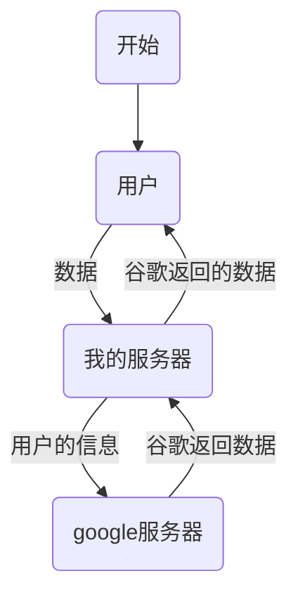

最开始接触镜像站还是当初在实验室的时候，当时还是一枚小菜鸟，不懂科学上网，然后在学姐的带领下，知道了镜像站的存在，现在虽然已经用不上镜像站了，但是还是想倒腾一下，而Nginx的反向代理正好也可以实现这个功能

<!--more-->

# 代理实现镜像站

其实，nginx的 *proxy_pass* 模块就可以实现，配置如下

~~~
        location / {
            proxy_pass https://www.google.com/;
        }
~~~

这样，将所有网站的请求都代理到谷歌，然后等待谷歌返回给我们，我们再展示就ok了，效果如下

# 进阶-小偷站

对于镜像站的实现原理其实是这样的

那么，既然数据是从我的服务器上经过的，我能不能将数据修改一下，伪装成我自己的站呢，连数据库都省的装了，答案当然是可以的

我们这里可以借助Nginx自带的模块 *ngx_http_sub_module* ，但是这个有点弱，也可以选用 github上的第三方模块  [*ngx_http_substitutions_filter_module*](https://github.com/yaoweibin/ngx_http_substitutions_filter_module)  来处理，安装过程就不赘述了

配置如下

~~~
         location / {
             proxy_pass https://www.baidu.com/;
             proxy_set_header Accept-Encoding "none";  # 防止gzip导致的替换失败
             subs_filter_types text/plain text/css text/xml; #替换html、css、xml内容
             subs_filter '百度一下' 'tyloafer' g;
         }
~~~

效果如下

