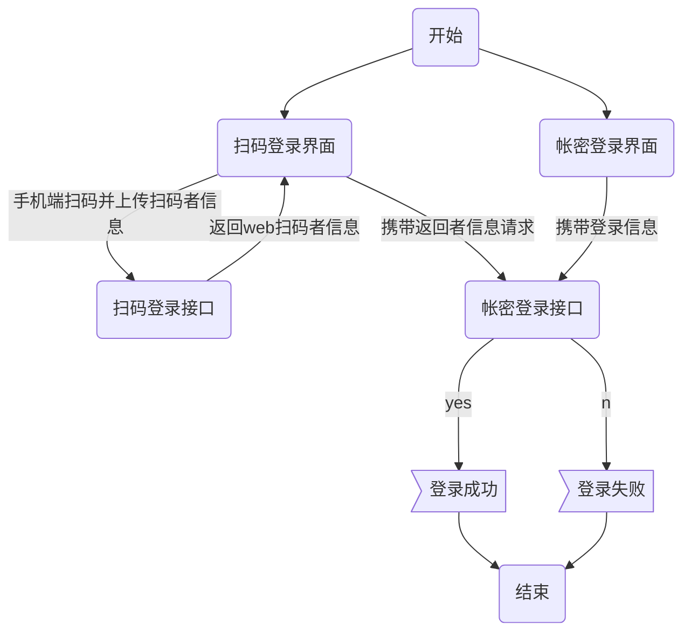

# 起因

在做项目的时候，做到登录这一块，需要同时支持扫码登录及账号密码登录，整体的思路如下



后来发现，webLogin的接口每次调用都特别慢，打开debug后，发现webLogin都是在scanLogin接口结束后，才能开始处理，webLogin被阻塞了。

<!--more-->

# 处理

排查过程比较繁琐，就直接省略了。这里的原因是，框架这里使用的是Yii2，Yii2会把在初始化的时候调用session_start()来启动session，而session是以文件形式存储的，session启动的时候会给相对应的session文件加上锁，接口处理结束时，取消锁，从而导致的第二个接口在调用的时候被挂起。

PHP中可以通过下面函数

~~~
session_write_close();
~~~

关闭session的文件锁。

# 扩展

## 当你调用 session_start() 时，都发生了什么

我们使用一个基本的 PHP 配置为例：当你开始一次 PHP 会话时，PHP会在 *session.save_path* 路径下创建一个普通的文件，默认路径为 */var/lib/php/session* 。所有的 session 数据都保存在这个地方。

如果你的用户还没有一个 session cookie ，那么 PHP 将产生一个新的 ID，并设置到用户机器的 cookie 中。如果是一个已访问过的用户，那么他会将 cookie 发送给你的 web 服务器，PHP 则会解析它，并且从 *session.save_path* 路径下加载到相应的 session 数据。
简而言之，这就是 *session_start()* 的所做的工作。

## 会话锁与并发

接下来我们举一个稍微完整一点的例子，来我们说明PHP初始化session后，各个场景下所发生的事情。

| Timing | PHP Code             | Linux/Server                             |
| ------ | -------------------- | ---------------------------------------- |
| 0ms    | `session_start();`   | 创建文件锁：/var/lib/php/session/sess_$identifier |
| 15ms   | SQL查询，for循环，第三方API调用 | 持有session文件锁                             |
| 350ms  | PHP脚本执行结束            | session文件锁被移除                            |

当你调用**session_start()**（或者PHP的**session.auto_start**被设置为true时，该方法会被自动调用），操作系统会锁住session文件。大多数文件锁的实现都是`flock`，在Linux上，它也用于[防止定时任务的重复执行](https://ma.ttias.be/prevent-cronjobs-from-overlapping-in-linux/)或者其它文件锁定工作。
在Linux机器上，一个session文件锁看起来就像这样子。

```
$ fuser /var/lib/php/session/sess_cdmtgg3noi8fb6j2vqkaai9ff5
/var/lib/php/session/sess_cdmtgg3noi8fb6j2vqkaai9ff5:  2768  2769  2770
```

`fuser`报告了3个进程的PID，这些进程要么正持有此文件锁，或者正在等待此文件锁的释放。

```
$ lsof /var/lib/php/session/sess_cdmtgg3noi8fb6j2vqkaai9ff5
COMMAND PID  USER      FD  TYPE DEVICE SIZE/OFF NODE   NAME
php-fpm 2769 http_demo 5uW REG  253,1  0        655415 sess_cdmtgg3noi8fb6j2vqkaai9ff5
```

`lsof`可以告知你当前持有文件锁的PID以及指令。
该session的文件锁会保持到脚本执行结束或者被主动移除（后面会讲到）。这是一个读写锁：任何对session读取都必须等到锁被释放之后。
锁本身并不是问题。它保护session文件中的数据，防止多个同时写入损毁数据或者覆盖之前的数据。
但是当第二个并发的PHP执行想要获取同一个PHP会话的时候，就会造成问题了。

| Timing | script 1             | Linux/Server                             | script 2                                |
| ------ | -------------------- | ---------------------------------------- | --------------------------------------- |
| 0ms    | `session_start();`   | script1锁定(`flock`)文件/var/lib/php/session/sess_$identifier | `session_start();`被调用，但是被锁阻塞。PHP等待锁被移除。 |
| 15ms   | SQL查询，for循环，第三方API调用 | 文件锁保持不变。                                 | 脚本仍然在等待，啥都不做。                           |
| 350ms  | script1执行结束。         | script1持有的文件锁被移除。                        | script2仍然在等待。                           |
| 360ms  |                      | script2得到新的文件锁。                          | script2现在可以执行它的SQL查询，for循环…             |
| 700ms  |                      | script2持有的文件锁被移除。                        | script2执行结束。                            |

解释一下上面的表格：

- 当2个PHP文件同时想要开始一个会话时，只有一个能赢且获得锁。另一个则需要等待。
- 当它等待的时候，不会做任何事情：`session_start()`阻塞了之后动作的执行。
- 一旦第一个脚本的锁被移除，第二个脚本在获得锁的同时就可以向后继续执行了。

**在绝大多数场景下，这都使得PHP对于同一个用户来说，表现得像是一系列同步脚本：一个执行完成后执行下一个，没有平行的请求。即使你使用AJAX调用这些PHP脚本也无济于事。**
所以，刚才两个脚本没能同时在350ms左右的时间执行完毕，第一个脚本350ms执行完毕，而第一个脚本则消耗两倍的时长执行了700ms，因为它得等第一个脚本先执行完。

## 可选的session处理器：redis，memcache，mysql

如果你在寻求一个快速的解决方案，觉得“我只需要把session保存在memcached里”，那么你会失望的。默认的memcached配置使用了与之前描述相同的、安全的逻辑：只要有一个PHP使用了sessions那它们就会阻塞。
如果你正在使用PHP的memcached扩展，你可以将`memcached.sess_locking`设置为“off”，来避免session锁。该配置项的默认值是“on”，与普通的session处理器一样会阻塞。
如果你在使用redis，那么你是幸运的，因为redis的session处理器还没有支持锁功能。用redis作为session存储后端，是没有锁的。
如果你在使用MySQL作为session后端存储，你会有一个自己的实现：没有一个PHP扩展实现了使用MySQL作为session存储的功能。在你的PHP代码中会有一个函数[session_set_save_handler()](http://php.net/manual/en/function.session-set-save-handler.php)申明了负责session数据读取和写入的类或者方法。也就是说你的代码实现决定了session是否会产生阻塞。

## PHP session锁：想要解决的问题

我对于session锁行为的看法看起过于负面了，但实际上我只是提醒你注意它的行为方式。其实锁的存在也它好的一面。
想象以下没有“session锁”的场景，当两个脚本同时处理同一个session数据时，可能引发错误：

| Timing | script 1                                 | script 2                                 |
| ------ | ---------------------------------------- | ---------------------------------------- |
| 0ms    | `session_start();`session数据被读入到$_SESSION变量中 | 1session数据被读入到$_SESSION变量中 |                                          |
| 15ms   | 脚本1写入session数据：`$_SESSION['payment_id'] = 1;` | 脚本2写入session数据：`$_SESSION['payment_id'] = 5;` |
| 350ms  | `sleep(1);`                              | 脚本结束，保存session数据                         |
| 450ms  | 脚本结束，保存session数据                         |                                          |

> session中的数据值应该是多少？
> 应当是脚本1的所保存的值。因为脚本2所保存的值被脚本1最后所保存的值覆盖了。

**这是一个非常尴尬，而且又很难排查的并发问题。session锁可以防止这种情况发生。**
绝大多数情况下，这是写session数据时才会碰到的问题。如果你有一个PHP脚本只是读取session数据（大多数ajax请求都是），你可以安全地对数据进行多次读取。
另一方面，如果你有一个长时间运行的脚本，它读取了session数据并且还会修改session数据，而另一个脚本开始执行并且读取到了旧的过时数据 — 这也可能使你的应用出错。

## 关闭PHP的会话锁：PHP 5.x 和 PHP 7

PHP中有一个方法叫做`session_write_close()`。它的功能如其名：写入session数据，关闭session文件，从而解除了session锁。你在PHP代码中，可以这样使用。

```
<?php
// This works in PHP 5.x and PHP 7
session_start();

$_SESSION['something'] = 'foo';
$_SESSION['yolo'] = 'swag';

session_write_close();

// Do the rest of your PHP execution below
```

上面的示例代码先开启了session（将session数据读到\$\_SESSION中），然后写入数据再解除锁。接下来，它就再也不能写入这个session文件了。如果接下来该脚本还在继续操作$_SESSION变量，那么这些变化都不会被保存下来。
从PHP 7开始，在调用`session_start()`的时候你可设置额外的选项。

```
<?php
session_start([
  'read_and_close' => true
]);
?>
```

以上语法等同于：

```
<?php
session_start();

session_write_close();
?>
```

它先读取了session数据，然后立刻释放了锁，这样就不会阻塞其它脚本了。