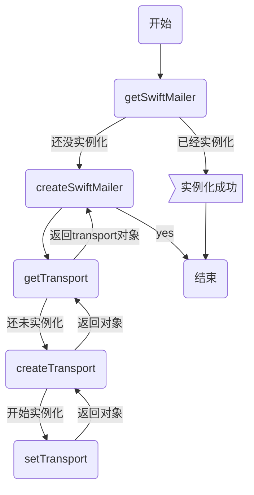

# 起因

邮件发送，在一个程序中，站着举足轻重的地位，所以，学会配置，Yii2的邮箱，也是入门的一项必要技能，但是，在业务发展过程中，有可能一不小心，邮箱被某些邮件服务上拉近黑名单了，很多这种情况就是因为，给不存在的用户发送邮件或被钓鱼了。这时候就需要设置多个邮箱，一个用于给未验证的用户发送邮件，一个给已验证的邮箱发送邮件，防止主要的邮箱被拉近黑名单。

<!-- more--->

# 配置单个邮箱

邮箱的配置在Yii2的文档中，写的还是比较详细的，可参考这里[http://www.yii-china.com/doc/guide/tutorial_mailing.html](http://www.yii-china.com/doc/guide/tutorial_mailing.html) 

将mailer注册进components中即可使用，个人的配置也先贴出来

~~~
'mailer' => [
            'class' => 'yii\swiftmailer\Mailer',         // 这里是邮件发送需调用的类
            'viewPath' => '@common/mail',                // 这个是邮件的模板文件，当你用compose()传入模板文件名称的时候，可以直接根据模板文件进行实例化，而不需要自己再多次重写html或txt 版本的邮件内容
            'useFileTransport' => false,                 // 如果开启这个选项，会把邮件信息保存在本地文件而不是发送它们
            'transport' => [                              // 这个便是发送邮箱的验证，这个下面会主要分析的
                'class' => 'Swift_SmtpTransport',
                'host' => 'xxxxxx',                      // 邮件服务商的host
                'username' => 'xxxxx',
                'password' => '*******',
                'port' => 465,                            // 端口 一般 端口是 25 ssl 465 tls 587
                'encryption' => 'ssl',//tls or ssl
                //'timeout' => 600,
                'streamOptions' => [                      // 走ssl验证时的规则
                    'ssl' => [
                        'allow_self_signed' => true,
                        'verify_peer' => false,
                        'verify_peer_name' => false,
                    ],
                ]
           ]
        ],
~~~

在上面的配置中国，会发现，相对于文档中 多了一个`transport`的 设置，这个就是邮箱的一些配置，我们可以通过这个配置连接我们的邮件服务器，进而收发邮件，那么，也就是说，我们修改了`transport`就是修改了我们的发件箱，我们在程序中随时更改`transport`也就可以实现我们最初的需求了，那么如何修改呢，接下来，我们一起看一下`Mailer`的实例化过程可能就清晰了。

# 分析Mailer实例化

下面截取了一些 *Mailer.php* 的 主要实例化用到的函数

~~~
    /**
     * @return array|\Swift_Mailer Swift mailer instance or array configuration.
     */
    public function getSwiftMailer()
    {
        if (!is_object($this->_swiftMailer)) {
            $this->_swiftMailer = $this->createSwiftMailer();
        }

        return $this->_swiftMailer;
    }

    /**
     * @param array|\Swift_Transport $transport
     * @throws InvalidConfigException on invalid argument.
     */
    public function setTransport($transport)
    {
        if (!is_array($transport) && !is_object($transport)) {
            throw new InvalidConfigException('"' . get_class($this) . '::transport" should be either object or array, "' . gettype($transport) . '" given.');
        }
        $this->_transport = $transport;
    }

    /**
     * @return array|\Swift_Transport
     */
    public function getTransport()
    {
        if (!is_object($this->_transport)) {
            $this->_transport = $this->createTransport($this->_transport);
        }

        return $this->_transport;
    }
    /**
     * Creates Swift mailer instance.
     * @return \Swift_Mailer mailer instance.
     */
    protected function createSwiftMailer()
    {
        return \Swift_Mailer::newInstance($this->getTransport());
    }
~~~

流程可以简单的如下所示

从上面的分析，我们可以看出，我们要更改`transport`的话，只需要调用`setTransport()`，并将我们的配置传给他即可。

# 配置多邮箱

既然，整体流程已经清晰，我们可以在params.php中添加一个数组

~~~
    'mailer' => [
        'gmail' => [
            'class' => 'Swift_SmtpTransport',
            'host' => 'smtp.gmail.com',
            'username' => 'xxxxxx,
            'password' => '*****',
            'port' => 587,
            'encryption' => 'tls',//tls or ssl
        ],
        '163' => [
            'class' => 'Swift_SmtpTransport',
            'host' => 'smtp.163.com',
            'username' => 'xxxxxx',
            'password' => '****',
            'port' => 465,
            'encryption' => 'ssl',//tls or ssl
            //'timeout' => 600,
            'streamOptions' => [
                'ssl' => [
                    'allow_self_signed' => true,
                    'verify_peer' => false,
                    'verify_peer_name' => false,
                ],
            ]
       ]
    ],
~~~

在需要用到邮箱发送且需要更换发送邮箱的地方，先用`setTransport()`设置发件箱配置即可。例：

~~~
$mailer =  Yii::$app->mailer;
$mailer->setTransport(Yii::$app->params['mailer']['gmail']);
$mailer->compose('register', $data)
       ->setSubject('多邮箱测试')
       ->setFrom('xxxxxx')
       ->setTo('xxxxxx')
       ->send();
~~~

